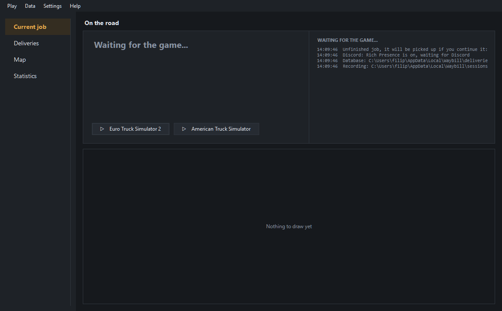
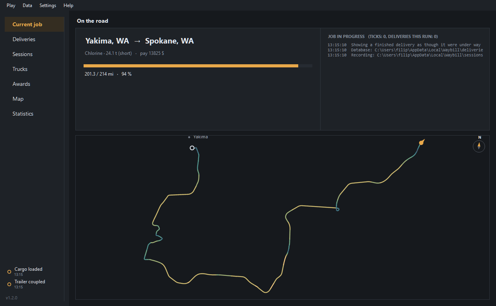
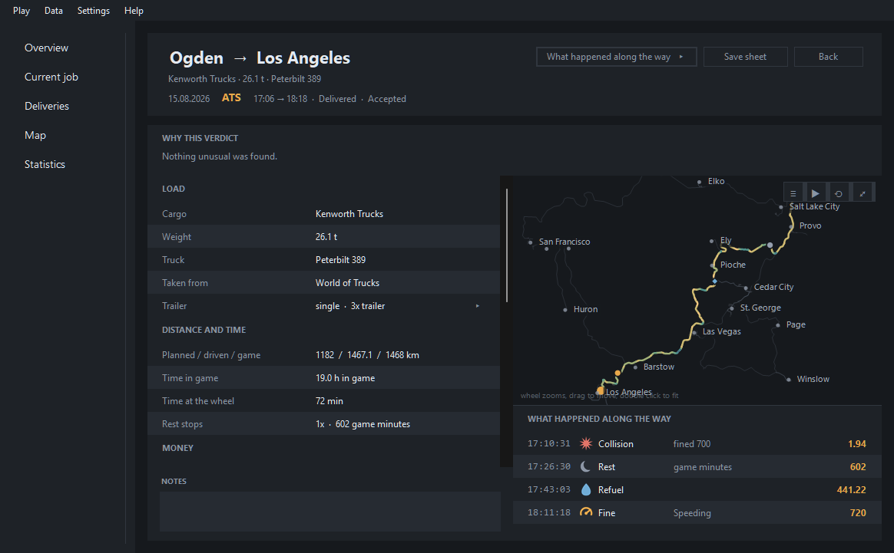
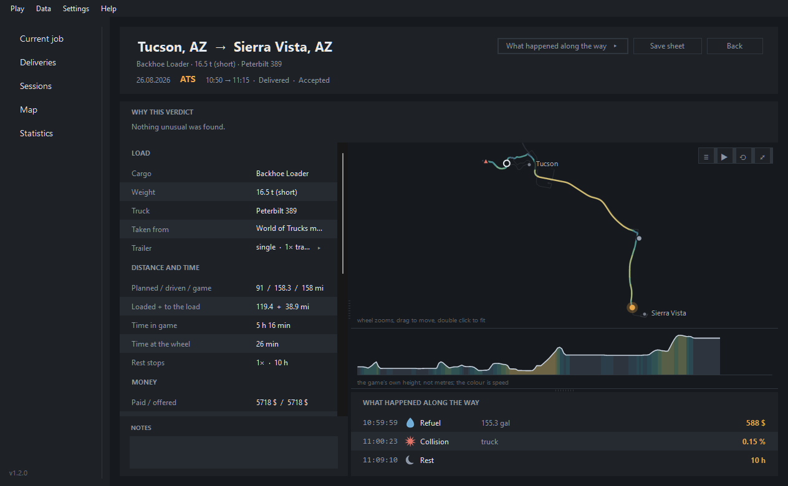
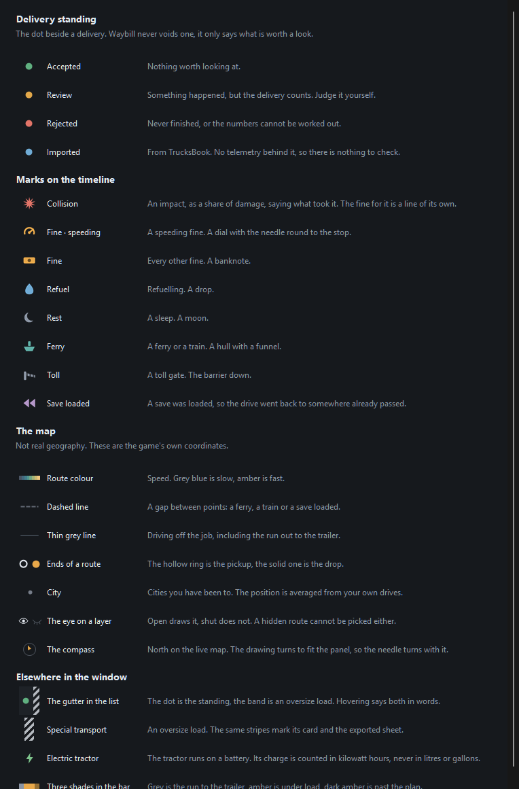
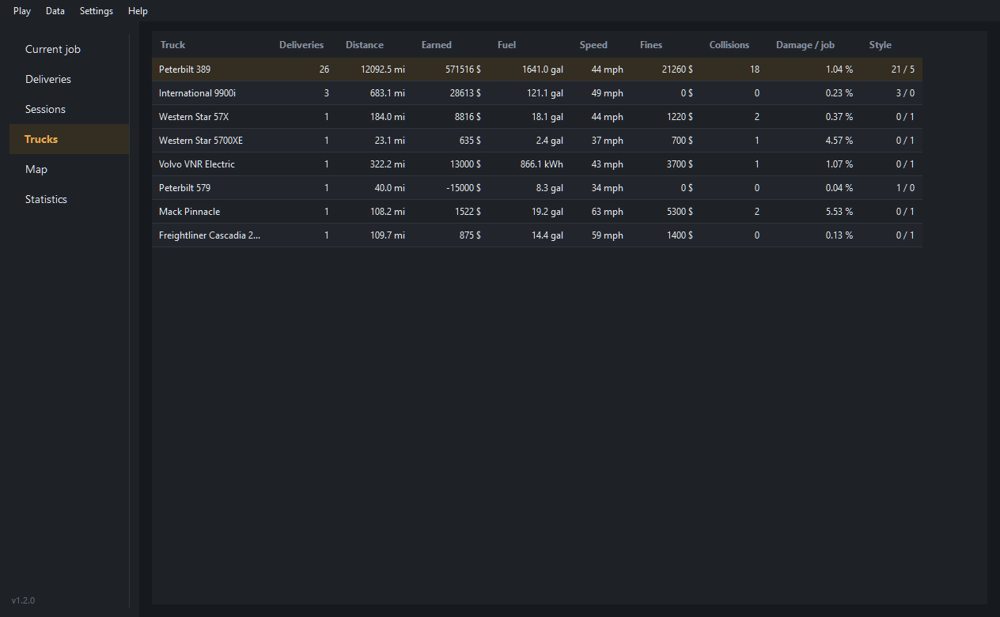
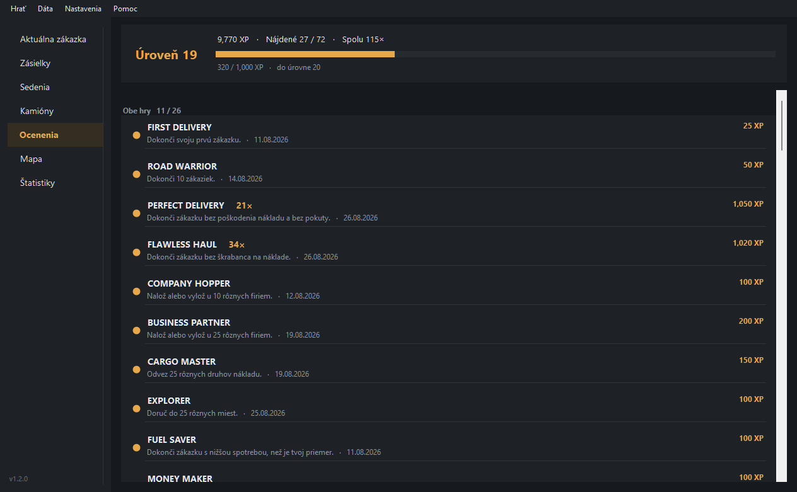
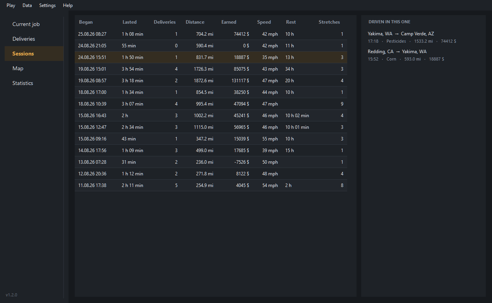
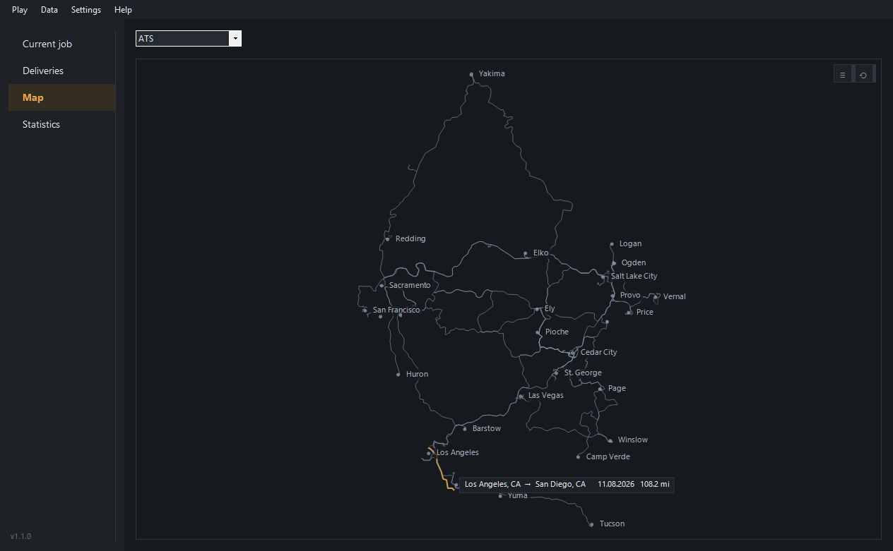
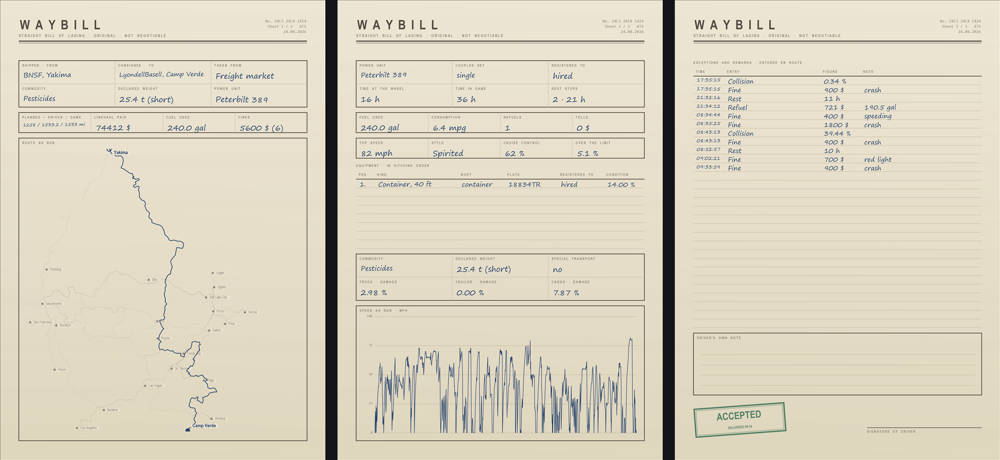

# Waybill

A local delivery tracker for **Euro Truck Simulator 2** and **American Truck
Simulator**. It detects the start and the end of a job on its own, writes it to a
local database and shows statistics. No account, no internet, no second program.

A *waybill* is the document that travels with a shipment and carries the route,
the cargo and the sender. That is exactly what this app keeps about every drive.


## Why it exists

TrucksBook invalidates a delivery if lane assist was switched on during it.
Waybill takes the opposite position:

> **A delivery is never invalidated because the driver used an assist.**

Assists, cruise control, speeding, collisions and fines are stored as metadata
and shown in statistics, never as grounds for refusing a delivery.

## How a delivery is judged

Every finished delivery gets one of three states.

| State | Meaning |
|---|---|
| `accepted` | Nothing unusual was found |
| `review` | Something is worth a look, but nothing suggests the driving was faked |
| `rejected` | Direct evidence that the driving did not happen |

**Rejection is reserved for a delivery being claimed without the driving behind
it.** There are three such cases, and no others:

* an odometer that moved further in one instant than driving can account for
* a distance of essentially zero
* a jump across the map that no vehicle could have driven, and only when the
  distance evidence agrees with it

That last one is deliberately narrow. A jump on its own is not proof of anything:
a ferry and a train both put the truck down somewhere it did not drive to, and the
game itself charges for the crossing a moment earlier, so a jump beside one of
those is recorded as the crossing it was. What decides a delivery is the distance,
which the game reports its own figure for on arrival. Two thousand kilometres of
Europe measured within a tenth of a percent of what the game said is a drive that
happened, whatever the middle of it looked like.

Everything else is a flag. A flag is visible on the row and says what it is,
and that is all it does: the delivery keeps its distance, its payout and its
place in the statistics, which count every row whatever its state. Reaching
review costs nothing.

A verdict is never left unexplained. Hovering it in the list names what was
found, and the delivery's own card opens with *Why this verdict*: each flag in
words, with the figures behind it where two measurements disagreed, and a line
saying plainly that none of it refuses the delivery.

What lands in review is, for instance, a job that stopped existing without
ending, one abandoned past its window, a top speed no truck reaches, or the two
independent distance measurements disagreeing with each other or with the figure
the game reports on arrival.

The distinction that matters: **not finishing a delivery is not cheating**.
Switching to another profile, quitting the game and never coming back, a crash
mid drive: none of that claims a delivery, so none of it is refused. It is
recorded for what it is, an unfinished drive, with the kilometres actually
driven kept.

The other half of the same idea is that ordinary play is recognised rather than
punished. Pausing into a menu or photo mode, sleeping in the cab, taking a ferry,
loading an earlier save, being teleported into a company truck by a quick job,
restarting the tracker mid delivery: each of these looks alarming in raw
telemetry, and each is identified for what it is instead of counting against the
driver.

Every state, flag and anomaly is listed with its meaning in
[`docs/reference.md`](docs/reference.md).

## Features

* Opens on the drive in progress: the figures, the log, and the route as it grows
* Detects the start and the end of a job with no manual input
* Measures distance, fuel, speed, damage, fines, tolls and ferries
* Records an event timeline, so the exact moment of a fine or a collision is kept
* Keeps every unit of a double or a triple, each with the damage it took
* Says which market a job came from, and whether the trailer was your own
* Explains every verdict in words rather than leaving a label on the row
* Draws where each delivery went, with every fine and collision marked on it
* Draws it the way it was driven, so the order things happened in is visible
* Draws the same drive from the side, so a slow hour explains itself
* Answers for a week or a month, and says how that compares with the one before
* Marks each thing that happened with a sign of its own, and explains every sign
* Names a trailer for what it is instead of for the file it came out of
* Marks an oversize load as one, on its card and in the list
* Marks an electric truck the same way, and counts its battery in kilowatt hours
* Tells a sleep from a charging stop, a repair or a job taken from a menu
* Draws the whole history as one map, built entirely from your own drives
* Writes a delivery out as a three sheet A4 waybill, as pictures or as one PDF
* Draws the route on that sheet over every road already driven, with the towns named
* Signs that sheet in your own hand, drawn once with the mouse and kept
* Names the state or the country a city is in, in the list, on the card and on the sheet
* Groups a night's driving into one sitting and says what came of it
* Says the last five things it noticed beside every page, each marked by what it was
* Keeps seventy-two awards, some of them repeatable, and its own level to show for them
* Counts kilometres in Europe and miles in America, and never turns one into the other
* Draws the drive in progress a second at a time, with a needle for which way it points
* Keeps the driving between jobs too, as distance and as lines on the map
* Resumes an interrupted job after a crash or after quitting mid drive
* Launches the game from the window, including a telemetry plugin check
* Shows a finished delivery on the live page, for looking at it with no game running
* Shows the current delivery on Discord, over the local pipe, with no account
* Imports history from TrucksBook
* Stores in SQLite, exports to CSV and JSON, backs up and restores
* Interface in English, Slovak, Czech, German and Spanish

## Requirements

* Windows
* [.NET 9 SDK](https://dotnet.microsoft.com/download) to build from source
* The RenCloud telemetry plugin, bundled in [`third-party/`](third-party/README.md)

## Installation

Build from source:

```bash
dotnet build src/Waybill
```

The app then starts from `Waybill.exe` in
`src/Waybill/bin/Debug/net9.0-windows/`.

The first step after launching is *Play → Install telemetry plugin*, which asks
for `Win64/scs-telemetry.dll` from `third-party/`. Without the plugin the game
publishes no telemetry and Waybill has nothing to track.

### Standalone .exe

Run from the repository root, since the paths in the command are relative:

```bash
dotnet publish src/Waybill -c Release -r win-x64 -p:PublishSingleFile=true -o dist
```

The result is a single `dist\Waybill.exe` of about 50 MB that runs on a machine
without .NET installed. It can be moved anywhere: the database and the recordings
live in `%LOCALAPPDATA%\Waybill\`, independent of where the exe sits.

## Usage

Start order does not matter, the app connects to the game as soon as it finds it.
Jobs are detected and saved without any input.

Four pages down the left.

*Current job* is where the window opens, and it is the only page that answers
"what is going on" rather than a question you have to arrive with. The figures
are on the left, the tracker's own log beside them, and the drive draws itself
underneath as it goes. With no game running it offers the two things worth
offering: starting one of the games, and the log that says whether the tracker
can see it.



With a job under way the buttons give way to the delivery: where it came from and
where it is going, the load and the pay, how far along it is, and the drive
drawing itself underneath.



That picture is a finished delivery shown on the live page, cut off five eighths
of the way along, because photographing the real thing needs a game running and a
load on the hook. Everything in it is read from the delivery rather than invented,
and you can put any of your own there the same way: `Waybill.exe --demo <id>`.
Nothing is written and no telemetry is touched, and the moment a game connects the
real drive takes the page back.

The map is the drive so far and nothing else: the hollow ring is where the load
went on, the line is coloured by speed like every other route here, and the
filled marker is where the truck is now, with a needle for which way it is
pointing. Where the truck is going can be worked out from two positions, where
it is pointing cannot, and the two are different things reversing onto a dock.
It redraws every second, which is the rate the tracker records at, and it can be
switched off in *Settings* for anyone who would rather the machine spent those
milliseconds on the game. It turns the drive to whatever angle fills the shape
of the panel it is in: a wide panel gets the drive lying down, a tall one gets it
standing up, and either way it fills the room instead of drawing a thread down
the middle. The angle is chosen by trying half a turn of them and keeping the one
that draws the route biggest.

It says how far it turned. North in both games is the negative z of their own
space, which the cities settle beyond doubt: sort the drops by z and Yakima comes
first and Tucson last. The drawing may be turned up to a quarter turn either side
of it, and a compass in the corner carries whatever turn was taken, so a picture
with north pointing sideways still says so.

It grows without twitching, and without losing the truck off the edge. A drive
being watched is refitted every second, and while everything still sits inside the
frame already drawn the picture is left exactly where it is. The frame keeps a band
along its edge that nothing is allowed into, and the truck is always the first
thing to reach it, so the drawing is refitted while there is still an inch of
picture ahead of the truck rather than at the moment it would leave.

The bar underneath counts the loaded leg against the game's own planned distance,
with the run out to the trailer in its own quieter shade at the head of it. It is
not clamped at the plan. Going past it is ordinary, a detour or a closed road, so
the bar rescales rather than filling up and stopping: at 112 % the plan sits nine
tenths of the way along and the overshoot is what is left, in a dimmer amber.

*Deliveries* is the history. Every row carries its verdict as a dot in the
gutter on the left, and an oversize load carries hazard stripes beside it;
hovering the gutter says both in words. Clicking a column heading sorts by it,
and the order chosen is kept: opening a delivery and coming back leaves the list
the way it was left rather than back on date order.

Above the list, a search box and two switches. Each switch has a middle position
meaning both, one end for **ETS2** and the other for **ATS**, and one end for an
ordinary load and the other for an oversize one. They are the two questions a
history is actually read with, and each is one click away from either answer.
There is no filter by verdict: it is a dot on every row already, and on a
history where almost everything is accepted, asking for "only the accepted ones"
is asking for the list you are looking at.

Double clicking a delivery, or pressing Enter on it, opens its own card. It starts
with why it got the verdict it did, then every figure the tracker kept.


*What happened along the way* slides a column out from the right: the route on
top, the timeline underneath it. Both are worth reading when something went wrong
and worth nothing when nothing did, so they stay out of the way until asked for.



The column has a handle down its left edge and another across it, between the
drawings and the log. How much of the card goes to the figures and how much to
the log is a question with no one answer, and so is how much of the column goes
to the map: a drive being picked apart wants the log wide, a drive with two
events in it wants the map. Whatever they are left at is what the next delivery
opens with.



Neither handle can be lost. Both are held inside what the card has room for
whenever it changes size, so a column pulled wide on a full screen does not fill
the whole card when the window is restored and leave its handle off the edge.

*Statistics* is the logbook at a glance, on one screen with no scrolling. Two
controls above the figures say which deliveries they are about: a period, and
which game. Pick a period and every figure that is a sum also says how it moved
against the same length of time immediately before it, so this week against last
week is one number on the tile rather than two pages to read back and forth
between.


A week runs from Monday and a month from the first, so *this week* is the week
you are in rather than the last seven days: a rolling window compared against the
window before it compares two overlapping halves of the same evening's driving.
The change is a percentage and never a verdict. Driving less this week than last
is not worse, it is a week.

Distance driven with nothing on the hook has its own tile there, beside the
deliveries rather than folded into them, and the delivery figure carries both
together underneath it.

## What the window says without words

A good deal of it is drawn rather than written. The dot in a row's gutter is its
verdict, the colour of a route is speed, hazard stripes mean an oversize load, and
each thing that happened on a drive gets a sign of its own on the timeline: a burst
for an impact, a dial for a speeding fine, a note for any other one, a drop, a
moon, a hull, a barrier, two chevrons back for a save loaded.

The strip at the foot of the sidebar has three of its own, since in a column that
narrow the words get cut and a mark never does: a hollow ring for a load taken on,
a filled one for a load handed over, a star for an award earned. It says the last
five things Waybill noticed, whichever page is open, and takes no room at all until
there is something to say.

The signs are drawn by the app itself rather than taken from a font, because the
glyphs for most of them live in fonts that may not be installed, and a missing one
comes out as an empty box exactly where the meaning was.

*Help → Legend* names all of them in one window, along with the marks on the map,
the three in the strip at the foot of the sidebar, and the two shades in the
progress bar. The samples in it are painted by the same
code the rest of the window paints with, so it cannot quietly drift away from what
it explains.



Two of them are for one moment, and that is deliberate too. A crash reports twice,
as an impact and as the fine for it, and they were folded into a single line for a
while on the grounds that two marks a second apart read as two things going wrong.
Folded, neither figure could be read: a collision is a share of damage and a fine
is an amount of money, and "Collision, 2.76 %, fined 900" is a line nobody can
take either number out of. So they are two lines, and the collision names what
took the hit, the truck or the trailer, with the load beside it when that was
shaken as well.

## One truck against another

*Trucks* puts every truck that has pulled a delivery on a line of its own:
what it has carried, how far, what it earned, what it drank, how fast it
averaged, what it cost in fines, and what a run costs it in damage.



Over the whole history rather than a period, because a truck's life is the
comparison worth having: one of them has pulled twenty-six loads and another a
single one, and a week's window would hide exactly that. Each row is in the unit
its own truck drinks, so a battery reads in kilowatt hours on the same page as a
tank reading in gallons.

Damage is what the truck takes on an average delivery rather than what it has
taken in total. A total grows with how much a truck has been driven, so it
compares your history rather than the trucks: 26.9 % against 0.4 % says only
that one of them has done twenty-six jobs and the other one.

A heading is one or two words throughout, and the ones that cannot be read off
those words say what they mean when the pointer rests on them, on the figures as
well as on the heading.

## What is worth having done

*Awards* is seventy-two of them on one page, under a line saying where the driver
stands: the level, what it took to get there, how many of the set have been found
and how many earnings that is in total.



Four shelves. Awards true of either game, the ladder of kilometres driven in
Europe, the ladder of miles driven in America, and the secret ones, which are not
named until they are found.

Distance is kept apart by game and never converted. Europe counts in kilometres
and America in miles, so a thousand miles is its own award and not a rounding of
a thousand kilometres.

An award can be repeatable, and then doing it again counts again and pays again.
A perfect delivery is worth the same the twenty-first time as the first, which is
what makes a clean run worth keeping up rather than worth doing once. The counter
beside the name says how many times over, and never appears at one.

Each award is worth Waybill experience, which is Waybill's own and has nothing to
do with the experience either game pays for a job. It adds up to a level, and
each level takes fifty more than the one before it, so the early ones pass while
a driver is finding out what the awards are and the later ones take a season.

What a run of deliveries was like is asked in the order they happened rather than
of the pile at the end, so a streak is a real streak: ten clean deliveries in a
row is not the same as ten clean deliveries.

They count what Waybill watched. A row imported from TrucksBook carries a distance
and a payout and nothing else, so most of these could never be true of it and the
rest would be true for nothing. Everything already in the logbook counts from the
day the page arrives, and it is backfilled in silence: the strip at the foot of
the sidebar names an award only when the delivery just finished earned it.

Nothing here is ever lost. A counter only climbs, and an award once earned stays
earned even if the rule behind it is rewritten afterwards, in a program whose
first rule is that a delivery is never taken away from the driver.

## A night's driving

*Sessions* is the page for the question a driver asks getting up from the desk:
what did I get done. The delivery card answers about one drive and the
statistics about a week or a month; neither of those is an evening.



A sitting breaks wherever the telemetry goes quiet for longer than an hour, and
that one rule covers both ways of stopping: closing Waybill leaves a gap between
two recordings, closing the game leaves a gap inside one, since a recording only
advances while the game is running. Neither is special, and a crash and a
restart in the middle of an evening is neither.

The hour is a preference rather than a constant, because it is the one number
here that somebody made up.

Two of its columns mean something particular and say so on hover: what was
finished in a sitting is counted there, with what it paid, and what was driven
in a sitting is measured there. A haul spanning an afternoon, an evening and the
next morning puts its kilometres in all three.

A delivery does not have to fit inside one sitting, and the page does not
pretend otherwise. What was finished in a sitting is counted there, with what it
paid, since that is when the job was done. What was driven in a sitting is
measured there: a haul spanning an afternoon, an evening and the next morning
puts its kilometres in all three, in the proportion they were driven. Counted
where it began, the other two evenings read as though nobody had driven at all.

It reads the whole history, so the sittings go back as far as the recordings do,
and the one selected shows its deliveries beside it, each a click from its own
card. `Waybill.exe --sessions` prints the same list.

## Where a city is

A list of thirty deliveries reads as a list of names unless you already know the
map. With the state or the country after them they are places: Yakima, WA down
to Camp Verde, AZ. It shows in the list, on the card, on the live page and on the
sheet, where two letters are worth the room. Not on the maps, which have the
names in them already and would become a page of abbreviations with a route
somewhere underneath. *Settings* has a switch for it.

Neither game reports it. Telemetry gives the city and the company and nothing
about the region either sits in, so it is a table, and it is deliberately
incomplete. A city that is not in it is shown exactly as the game named it,
which is what happens for every map mod. A missing code says "not known"; a
wrong one would say something false about a delivery.

The game names a city twice, once for a person and once for itself, and both are
kept. Two cities can share a name inside one game and never an identifier, so
where the name is ambiguous the identifier settles it: American Truck Simulator
has a Salina in Utah and another in Kansas, and the Utah one is `salina`. The
identifier is also what the game calls a city in every language, so none of this
depends on the game being in English.

## Doubles and triples

The game shows one condition for the whole set however many units are behind the
truck. Telemetry has them separately, and Waybill keeps each one.

The *Trailer* line folds the set away: closed it says what the set is, opened it
lists every unit in the order they are hitched, with its plate and the condition
it was hitched in against the condition it arrived in. A dolly is named as a
dolly, so counting or averaging does not treat the converter as cargo capacity,
and a trailer you own says so.

A unit you own carries the name you gave it. One handed over with the job has
none, and the game identifies it by the file it came out of, so
`blade_hauler.chassis_40x2esii` is read for what it holds: the body type and the
length, giving *Blade hauler, 40 ft*. That is what a driver would say about it,
and it is what fits in a column.


The configuration comes from the game itself, which is where `single`, `double`,
`rmdouble` and `triple` come from. It is worth knowing that the game reports its
own idea of it: a three section car transporter calls itself `single`, because it
is one articulated vehicle rather than a road train.

Splitting the set apart is not only bookkeeping. On one triple the leading unit
took fifteen times the body damage of the others while the wheels wore evenly
across all three, which is the difference between clipping something and simply
driving a long way. One figure for the set hides that entirely.

Damage is given as two figures throughout, on the card and on the sheet: what the
truck, each unit and the load were in when the load went on, and what they were
in when it came off. One figure was never enough. Against a truck it meant what
this drive did to it, against the load it meant what it arrived in, and the two
were told apart only by knowing which was which. Said as one figure arriving at
another, a trailer that gets to the drop at eighteen percent says plainly whether
it left the yard at nothing or at seventeen.

Deliveries recorded before this was kept have only the difference and say only
that, rather than claiming the set left undamaged. *Data → Rebuild* fills them in
from their recordings.

## The map

Position has been recorded once a second since the first delivery, so every drive
already had a shape long before anything drew one.

A delivery's card shows its own route, coloured by speed, over every other route
the profile has driven. Fines, collisions, refuels and rests are marked on it,
each tied to the position the truck was in when it happened. The *Map* page shows
the same thing without a delivery singled out: every drive of one game at once,
where pointing at a route names it and clicking one opens its card. It is a second
way into the history, since the list answers when something was driven and this
answers where.



Wheel zooms, dragging moves, double clicking fits. Two buttons sit over the top
right: what to draw, and fit the view. The eye beside each layer says whether it
is being drawn, and a layer that is hidden cannot be picked either, so nothing
opens from a line that is not on the screen. Cities stay visible whatever else is
turned off, since they are what makes the rest readable.

The same map, smaller, sits in the panel a delivery's card slides out, where a
third button opens it full screen.

### The same drive from the side

Under the map is the height the drive was at, coloured by the same eight speeds
the route is, and drawn out alongside it at the same rate. A route from above
says where the drive went; it does not say why forty minutes of it were spent at
fifty. The mountain says that.

Pointing at either drawing marks the same moment in the other, so a climb on the
profile can be found on the map and a bend on the map can be found on the
profile. They agree by the clock rather than by counting points, since the
profile averages its readings down to one a pixel while the map keeps every one
of them.

It reports no height in metres and no gradient, for the reason the map reports no
distances: the game's vertical is not a scaled version of the real one either.
The drop at Winslow sits at the same height in the game as the drop at Tucson
while the real places are eight hundred metres apart, and across the cities
driven to the ratio between game and reality runs from under one to over thirty
six. What is left is true and is the useful part: the order of the climbs, their
size against each other within the drive, and the speed on each. The measurements
are in [`docs/measurement.md`](docs/measurement.md).

### A route draws itself

Opening the panel draws the line from the pickup to the drop rather than showing
it finished, and the play button does it again. It is time being replayed rather
than distance: the points are a second of driving apart, so the line runs on an
open road and dawdles through a city, exactly as the drive did. Pins arrive as
the line reaches them, and a marker rides the head of it until it gets to the
far end.

That is worth more than it sounds. A finished line says where the drive went and
nothing about the order it happened in, and the same picture with a collision
near the end reads quite differently from one with a collision on the way out.
Touching the map at all ends the replay and shows the whole route, because a
drawing still being drawn is in the way the moment you want to look at it.

### There is no real map underneath, on purpose

The game's world is not a scaled United States. Measured across nineteen
deliveries, some pairs of cities sit thirteen times closer than reality and others
thirty, which is a difference of more than twice within the same map. SCS did not
shrink a country; they laid out a road network that plays well and put the cities
where that worked.

So no projection fits. Fitting the closest one anyway leaves cities about thirty
kilometres out under cross validation, and neither a quadratic fit nor a spline
through the cities as control points does better. Thirty kilometres is roughly
twenty minutes of driving: a state border drawn that far off would put the truck
in the wrong state, which is exactly the sort of small lie this project tries not
to tell.

What is drawn instead comes entirely from the driver's own data, where every
position is exactly where the game put it:

* **The routes already driven** are the background. They are the one backdrop that
  cannot be wrong, and the picture fills in as more gets driven.
* **Cities are learned** from the jobs themselves. Each names the city it loaded
  in and the one it unloaded in, and the recording says where the truck was. A dot
  is really the middle of the depots used there, so a city seen once is one depot
  wearing the city's name.

Nothing on the map ever reports a distance, and it never will. The length of a
line on it is not kilometres; the odometer answers that.

### A route is the load's journey

It begins where the load went on, not where the job was accepted. On a contract
that is where you hitched up to a waiting trailer; pulling your own it is the dock,
since you were coupled long before that; on a quick job the truck is set down at
the depot already loaded, so it is the start.

Whichever it was, the recording usually opens with a drive that is getting to work
rather than the consignment moving. That stretch is still drawn, in the same quiet
style as any other driving off the job, but it belongs to no delivery: it cannot be
pointed at or opened, and it is not part of the line the delivery owns.

Nothing that happened during it is recorded either. A fine picked up on the way to
the trailer is not the consignment's history, so the timeline starts where the load
does, and the hitching itself is not listed on it: it is the first line's own
beginning, not something that happened along the way.

The kilometres are still counted, and now counted separately. A delivery's card
shows the two legs on their own line, and the progress bar on *Current job* draws
the run-up as a quieter stretch at its head so the loaded part reads against the
plan. That matters more than it sounds: the game plans its route from the load, so
measured across the deliveries here the loaded leg lands within a few percent of
the planned figure on every delivered job, while the total ran as much as twelve
percent over it.

On a quick job, where the truck is put down at the depot already loaded, there is
no run-up at all.

### Driving that belongs to no delivery

Everything driven with nothing on the hook is kept too: between jobs, out to a
trailer, or simply going somewhere. It is drawn as a quieter line and is not
clickable, because there is nothing behind it to open, and it counts towards its
own total rather than being folded into the deliveries.

On the history here that is 292.7 km over five stretches, about five percent of
everything driven. Most of it retraces roads the deliveries already cover, which
is the point: it is the same network, filled in.

### What is not drawn as driving

Two stretches are deliberately shown as a dashed break rather than a line. The
first point of a job is where the driver stood when the offer was accepted, which
on a quick job is another city entirely, and a ferry, a train or loading an
earlier save moves the truck mid drive. None of them were driven along.

## Saving a delivery as a sheet

*Save sheet* on a delivery's card writes it out as the document the app is named
after: A4 upright, the form printed and the figures written in.



Three sheets, always the same three, because a consignment note has always been a
document with a front and a back. The front is the consignment: shipper and
consignee, the load, the figures, and the route as it was actually run. The
second is the equipment: the truck, the coupled set unit by unit with plates and
condition, what the run cost in fuel, time and tolls, and the speed trace from the
first mile to the last, which is the chart a tachograph would have drawn. The back
is the log of everything that happened along the way, ruled to the foot of the
page, with the driver's own note under it and the stamp beneath that.

The route is drawn over every other road this profile has been down, faintly, with
the towns named and the two ends of this delivery named in the hand the rest of it
is written in. A thread across an empty panel says how far the truck went and
nothing about where; with the network behind it, the same thread says which way it
came out of Yakima.

Nothing on any of the sheets is sized from the delivery. Every panel, every rule
and every box is worked out from the paper alone, so the form is the same form
every time and only the writing on it changes. That includes the hazard band,
which is counted whether the load carries one or not: letting those seven
millimetres back into the page on an ordinary delivery would move every rule on
all three sheets, and make it a slightly different form for an oversize load. A
quiet run leaves the lines ruled and empty rather than closing them up, which is
what a printed form does.

Everything the driver could have written is written: the values in the boxes, the
coupled set, all four columns of the log, and the note pad at the foot. What was
printed on the form stays printed. The figures are in the game's own units, not
the window's, however the window is set: a sheet that says 68 459 € for a job the
game paid 74 412 $ for is a translation of a receipt rather than the receipt.

The signature at the foot is your own. *Settings → Signature* opens a pad on the
same stock, in the same ink, with the same rule under it; sign it once with the
mouse and every sheet from then on carries it. It is kept as the strokes rather
than as a picture, so it is fitted to whatever room the sheet has and drawn in
the sheet's ink. Until it is drawn the line is left blank, which is what a form
does when nobody has signed it: printing a name onto a signature line is the one
thing a document must not do.

It saves as pictures or as one PDF, and offers your pictures folder rather than
the app's own. It is rendered at 300 dpi either way, so it prints as well as it
posts. A delivery with more remarks than the log has lines runs onto a fourth
sheet, which reprints the heading and carries the stamp at its foot.

This is the only place the paper idea lives, and that is deliberate. As a skin for
the window it would have cost the map its zooming and clicking, or left two
different maps in the app, and a fixed sheet cannot hold seven trailer units. A
file has none of those problems: it is a fixed size by definition, nobody expects
to click it, and running onto a second sheet is what paper has always done about
too much content.

From a script:

```bash
Waybill.exe --export-sheet <id> [path.png|path.pdf]
```

## Discord

*Settings → Discord* puts the current delivery on the Discord profile: the route,
the cargo, how far along the drive is, and a counter of how long it has been
running. Between jobs it says so, and with the game closed it shows nothing at
all.

There is nothing to set up. Waybill carries its own Discord application, so the
presence works as soon as the switch is on, which it is by default. Discord not
running simply means nothing is shown.

Waybill itself sends nothing to the internet: it hands the lines to the Discord
client on the same machine through its local pipe, and Discord publishes them the
way it publishes any game you are playing. Whether they reach anyone at all is
Discord's own setting, *User Settings → Activity Privacy → Display current
activity as a status message*, which governs every application including this
one. Turning the switch off in *Settings → Discord* stops Waybill sending
anything in the first place.

*Settings → Discord → Application ID* is there for anyone who wants their own
name and icons above the presence instead of Waybill's. Create an application at
[discord.com/developers](https://discord.com/developers/applications), upload
square images under *Rich Presence → Art Assets* keyed `ets2`, `ats` and
`waybill`, and paste the Application ID in. Leaving it empty uses Waybill's own.
The ID is public by design and is not a password; the secrets in that portal are
the client secret and the bot token, and Waybill asks for neither.

The application needs no verification. Discord's verification, with its team,
terms of service and privacy policy, is for bots that want to join more than a
hundred servers. Rich Presence is not a bot and is not affected by it.

## Command line

The window is the usual way to use it, but everything also works from a script:

```bash
Waybill.exe --list [n]                  # recent deliveries
Waybill.exe --stats [days]              # summary, overall or for a period
Waybill.exe --export csv|json [path]    # export the history
Waybill.exe --import-trucksbook <csv>   # import history from TrucksBook
Waybill.exe --backup [path]             # back up the database
Waybill.exe --restore <path>            # restore from a backup
Waybill.exe --export-sheet <id> [path]  # one delivery as an A4 waybill, 300 dpi
Waybill.exe --sessions                  # the sittings at the wheel
Waybill.exe --demo <id>                 # show a finished delivery as though under way
Waybill.exe --rebuild                   # recompute deliveries from recordings
Waybill.exe --replay <recording>        # replay an old recording
Waybill.exe --test-resume <recording> <line>   # test resume after a restart
```

## Where the data lives

Everything sits in `%LOCALAPPDATA%\Waybill\`, outside the project folder, so a
rebuild or a `dotnet clean` cannot take any of it with it.

| What | Where |
|---|---|
| Delivery database | `deliveries.db` |
| Backups | `backups/` |
| Raw telemetry recordings | `sessions/` |
| Job in progress | `in-progress.json` |
| Settings, including the Discord application ID | `settings.json` |

Recordings are packed into `.gz` once a session ends, roughly 13x less space.
They are never deleted: they are the input for `--rebuild` and `--replay`, both
of which read them packed or unpacked.

A delivery's identity is computed from the game, the moment the job was accepted
and the offer itself, so the same drive always derives to the same delivery. That
is what lets a rebuild update the history rather than having to delete it first.

## Units

By default they follow the game. ATS uses imperial (mi, gal, mph, $) and ETS2
metric (km, l, km/h, €), and money stays in whatever the game paid: two games,
two currencies, never added together. A total spanning both is shown as both,
side by side.

The *Units* menu forces one system for both, and the currency goes with it. A
page in kilometres is in euros and a page in miles is in dollars, and the other
game's money is converted rather than relabelled, so a figure that says € is in
euros and a total across both games is one number.

The rate is fixed, at 0.92 € to the dollar, and lives in one place in
`Units.cs`. Fixed on purpose: a rate that moved with the real one would rewrite
the past, and the same delivery would be worth a different amount next month
without anything about the drive having changed.

It is worth knowing what that rate is and is not. The two games do not share an
economy. SCS pay roughly the same figures for the same work in each, so a haul
earning 30 000 in one earns about 30 000 in the other, and putting a real world
rate between them says a game dollar is worth what a real dollar is, which is
not a thing anybody measured. It is there because one column of money is easier
to read than two, and *Follow the game* is the setting for anyone who would
rather not have the convention at all.

The database always stores metric and converts only for display. The history
therefore does not depend on which setting was active during the drive, and
switching redraws old deliveries too.

## How distance is measured

Distance follows the odometer, the same unit system the game itself and the job
offer report. World position is stored separately, for teleport detection and for
drawing the route later. Details in [`docs/measurement.md`](docs/measurement.md).

## Importing from TrucksBook

*Data → Import history from TrucksBook*, then pick the CSV export. The import is
idempotent and keyed on the TrucksBookID, so the same file can be run repeatedly
without producing duplicates.

The export uses the units of that profile and every value carries its unit with
it (`157 mi`, `5.9 mpg`), so conversion follows what is actually in the file.
Imported deliveries get the `imported` status, because there is no telemetry
behind them to verify.

Deliveries that TrucksBook counted as 0 distance, meaning the ones it refused,
are imported with their planned distance and a note. Waybill counts them.

## Development

The recordings in `sessions/` double as regression tests. After a change in the
tracker:

```bash
Waybill.exe --replay <recording>
```

and compare the numbers. `--test-resume` additionally simulates a restart in the
middle of a drive and compares the result against one continuous run.

`--rebuild` is worth running after every detection fix, because old rows
otherwise keep the verdict issued by the version current at the time.

It only touches the periods the recordings cover. A delivery driven at a time no
surviving recording spans is kept exactly as it is rather than deleted in the
hope something replaces it, and the run reports how many were kept that way.
Imported rows are left alone too, as there is nothing to recompute them from.
Everything is replayed before anything is deleted, so an unreadable recording
cannot leave the history half restored, and a backup is taken first regardless.

## Layout

```
src/Waybill/
├── Tracking/       job state machine, SDK adapter, engine, formatting
├── Storage/        SQLite (deliveries, events, trip_points), TrucksBook import
├── Integrations/   Discord Rich Presence over the local pipe
├── SCSSdkClient/   vendored C# SDK client (MIT, with local fixes)
├── GameLauncher.cs finding and launching the games through Steam
├── RouteView.cs    drawing routes, cities and event pins
├── RouteGeometry.cs where a recording stops being a drive, shared by both
├── WaybillSheet.cs a delivery painted as an A4 document
├── MainForm.cs     the window
└── Program.cs      CLI and entry point
assets/             logo and icon source
docs/               vision, roadmap and technical notes
third-party/        telemetry plugin for the game
archive/            retired, no longer used
```

## Status

Working: automatic tracking and saving, launching the game from the app, resume
after a restart, history with search and notes, statistics with period comparison,
sittings at the wheel, one truck against another, awards with their own levels, the
event timeline, per unit damage across a coupled set, the route map with event pins,
the drive replayed along its own line, the height profile beside it, the map of the
whole history, the printable waybill, Discord Rich Presence, TrucksBook import,
export and backups.

Missing: GPX and KML export, fuel and cargo weight as totals in the logbook, and
which way the truck was pointing in a finished recording. Replay from inside the
cab is not planned: one position a second is a line on a map, not a camera. Details
in [`docs/roadmap.md`](docs/roadmap.md).

## Licence

[MIT](LICENSE). The vendored SDK client and the RenCloud plugin are MIT as well,
so the whole project sits under one licence.

Waybill is not affiliated with TrucksBook, endorsed by it, or a continuation of
it. The name appears here only to refer to the service whose CSV exports the
import reads, and to explain what this project does differently. Euro Truck
Simulator 2 and American Truck Simulator are the property of SCS Software, who
are likewise not involved in this project.
