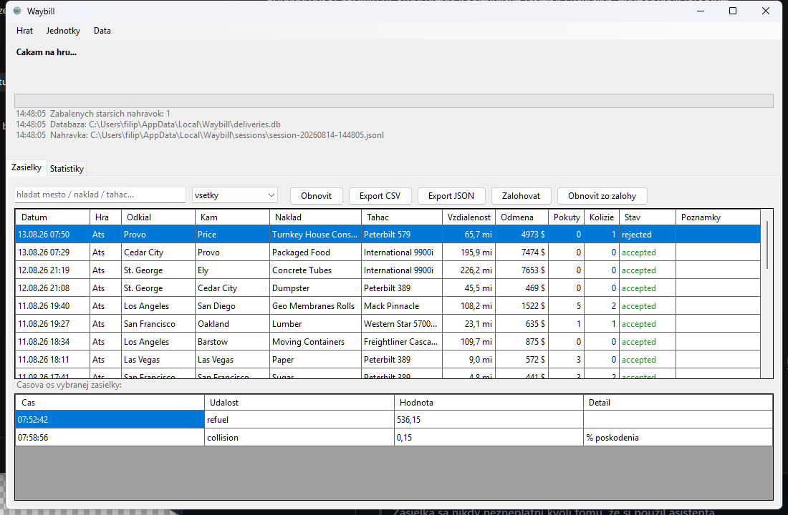

# Waybill

A local delivery tracker for **Euro Truck Simulator 2** and **American Truck
Simulator**. It detects the start and the end of a job on its own, writes it to a
local database and shows statistics. No account, no internet, no second program.

A *waybill* is the document that travels with a shipment and carries the route,
the cargo and the sender. That is exactly what this app keeps about every drive.



## Why it exists

TrucksBook invalidates a delivery if lane assist was switched on during it.
Waybill takes the opposite position:

> **A delivery is never invalidated because the driver used an assist.**

Assists, cruise control, speeding, collisions and fines are stored as metadata
and shown in statistics. Only direct evidence that no driving happened will
reject a job: a teleport to the destination, a missing completion event, or a
distance close to zero. Everything else gets flagged for review, not refused.

## Features

* Detects the start and the end of a job with no manual input
* Measures distance, fuel, speed, damage, fines, tolls and ferries
* Records an event timeline, so the exact moment of a fine or a collision is kept
* Stores route coordinates for a map view later on
* Resumes an interrupted job after a crash or after quitting mid drive
* Launches the game from the window, including a telemetry plugin check
* Imports history from TrucksBook
* Stores in SQLite, exports to CSV and JSON, backs up and restores
* Interface in English and Slovak

## Requirements

* Windows
* [.NET 9 SDK](https://dotnet.microsoft.com/download) to build from source
* The RenCloud telemetry plugin, bundled in [`third-party/`](third-party/README.md)

## Installation

Build from source:

```bash
dotnet build src/Waybill
```

The app then starts from `Waybill.exe` in
`src/Waybill/bin/Debug/net9.0-windows/`.

The first step after launching is *Play → Install telemetry plugin*, which asks
for `Win64/scs-telemetry.dll` from `third-party/`. Without the plugin the game
publishes no telemetry and Waybill has nothing to track.

### Standalone .exe

Run from the repository root, since the paths in the command are relative:

```bash
dotnet publish src/Waybill -c Release -r win-x64 -p:PublishSingleFile=true -o dist
```

The result is a single `dist\Waybill.exe` of about 50 MB that runs on a machine
without .NET installed. It can be moved anywhere: the database and the recordings
live in `%LOCALAPPDATA%\Waybill\`, independent of where the exe sits.

## Usage

Start order does not matter, the app connects to the game as soon as it finds it.
Jobs are detected and saved without any input.

The top of the window shows the job in progress, the *Deliveries* tab holds the
history with search, filter and notes, and the *Statistics* tab holds the summary.

## Command line

The window is the usual way to use it, but everything also works from a script:

```bash
Waybill.exe --list [n]                  # recent deliveries
Waybill.exe --stats [days]              # summary, overall or for a period
Waybill.exe --export csv|json [path]    # export the history
Waybill.exe --import-trucksbook <csv>   # import history from TrucksBook
Waybill.exe --backup [path]             # back up the database
Waybill.exe --restore <path>            # restore from a backup
Waybill.exe --rebuild                   # recompute deliveries from recordings
Waybill.exe --replay <recording>        # replay an old recording
Waybill.exe --test-resume <recording> <line>   # test resume after a restart
```

## Where the data lives

Everything sits in `%LOCALAPPDATA%\Waybill\`, outside the project folder, so a
rebuild or a `dotnet clean` cannot take any of it with it.

| What | Where |
|---|---|
| Delivery database | `deliveries.db` |
| Backups | `backups/` |
| Raw telemetry recordings | `sessions/` |
| Job in progress | `in-progress.json` |
| Settings | `settings.json` |

Recordings are packed into `.gz` once a session ends, roughly 13x less space.
They are never deleted: they are the input for `--rebuild` and `--replay`, both
of which read them packed or unpacked.

## Units

By default they follow the game. ATS uses imperial (mi, gal, mph, $) and ETS2
metric (km, l, km/h, €). The *Units* menu forces one system for both.

The database always stores metric and converts only for display. The history
therefore does not depend on which setting was active during the drive, and
switching redraws old deliveries too.

## How distance is measured

Distance follows the odometer, the same unit system the game itself and the job
offer report. World position is stored separately, for teleport detection and for
drawing the route later. Details in [`docs/measurement.md`](docs/measurement.md).

## Importing from TrucksBook

*Data → Import history from TrucksBook*, then pick the CSV export. The import is
idempotent and keyed on the TrucksBookID, so the same file can be run repeatedly
without producing duplicates.

The export uses the units of that profile and every value carries its unit with
it (`157 mi`, `5.9 mpg`), so conversion follows what is actually in the file.
Imported deliveries get the `imported` status, because there is no telemetry
behind them to verify.

Deliveries that TrucksBook counted as 0 distance, meaning the ones it refused,
are imported with their planned distance and a note. Waybill counts them.

## Development

The recordings in `sessions/` double as regression tests. After a change in the
tracker:

```bash
Waybill.exe --replay <recording>
```

and compare the numbers. `--test-resume` additionally simulates a restart in the
middle of a drive and compares the result against one continuous run.

`--rebuild` is worth running after every detection fix, because old rows
otherwise keep the verdict issued by the version current at the time. It is
lossless, since every tracked delivery has a recording behind it. Imported rows
are left alone, as there is nothing to recompute them from.

## Layout

```
src/Waybill/
├── Tracking/       job state machine, SDK adapter, engine, formatting
├── Storage/        SQLite (deliveries, events, trip_points), TrucksBook import
├── SCSSdkClient/   vendored C# SDK client (MIT, with local fixes)
├── GameLauncher.cs finding and launching the games through Steam
├── MainForm.cs     the window
└── Program.cs      CLI and entry point
assets/             logo and icon source
docs/               vision, roadmap and technical notes
third-party/        telemetry plugin for the game
archive/            retired, no longer used
```

## Status

Working: automatic tracking and saving, launching the game from the app, resume
after a restart, history with search and notes, statistics, event timeline,
TrucksBook import, export and backups.

Missing: the map and route replay, although the coordinates are already being
collected, plus achievements and whole session statistics. Details in
[`docs/roadmap.md`](docs/roadmap.md).

## Licence

[MIT](LICENSE). The vendored SDK client and the RenCloud plugin are MIT as well,
so the whole project sits under one licence.
