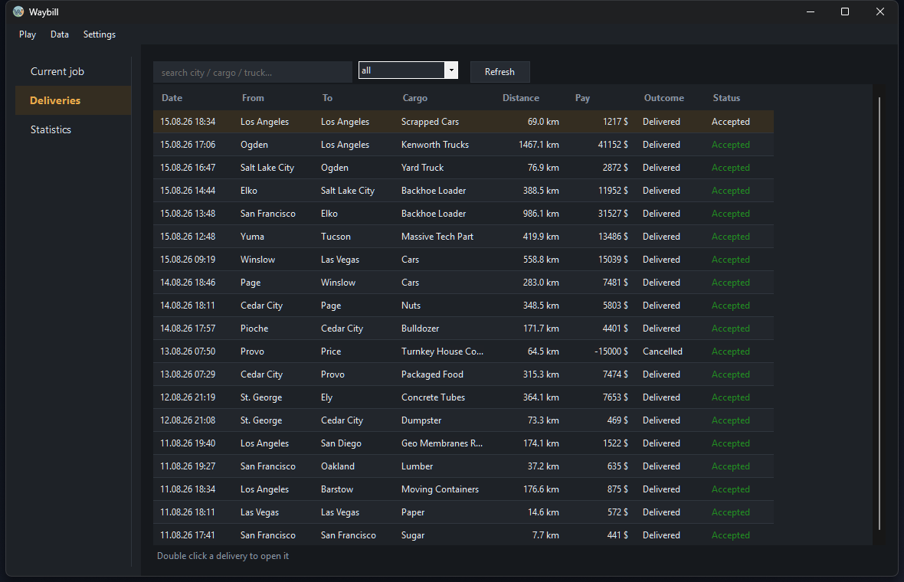
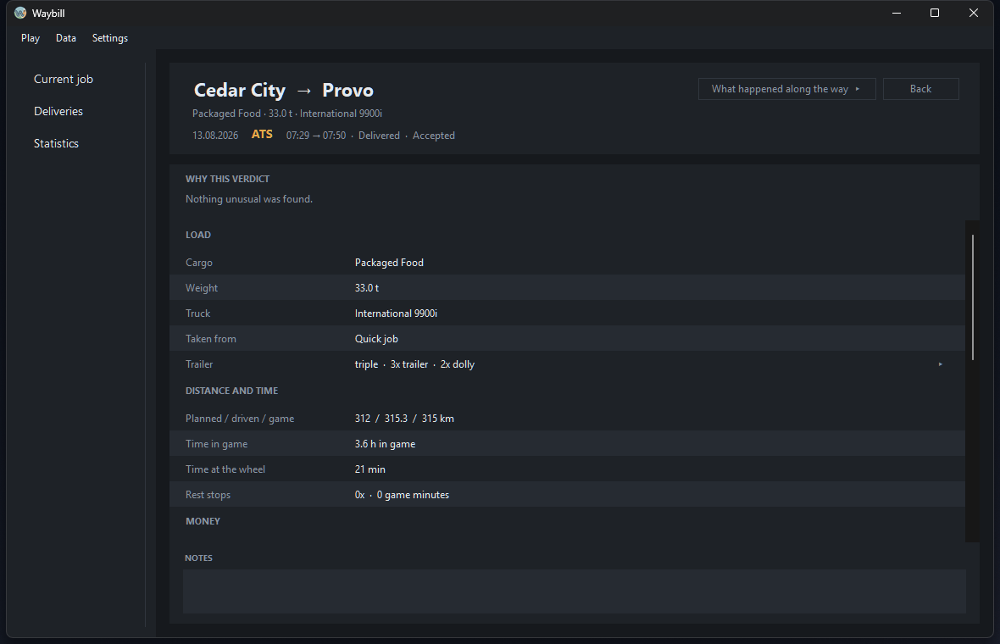
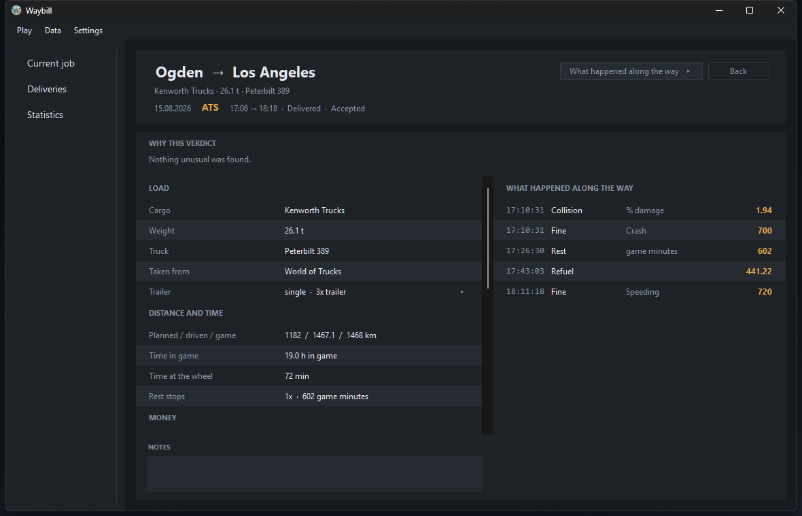
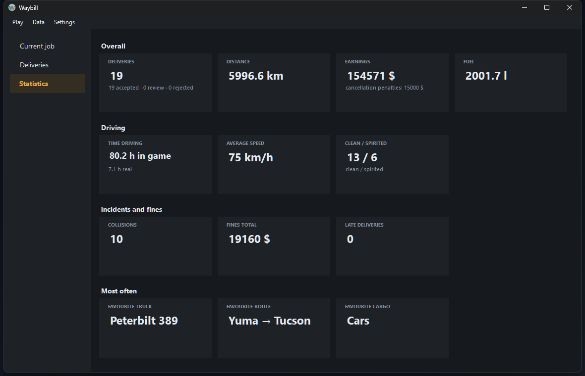
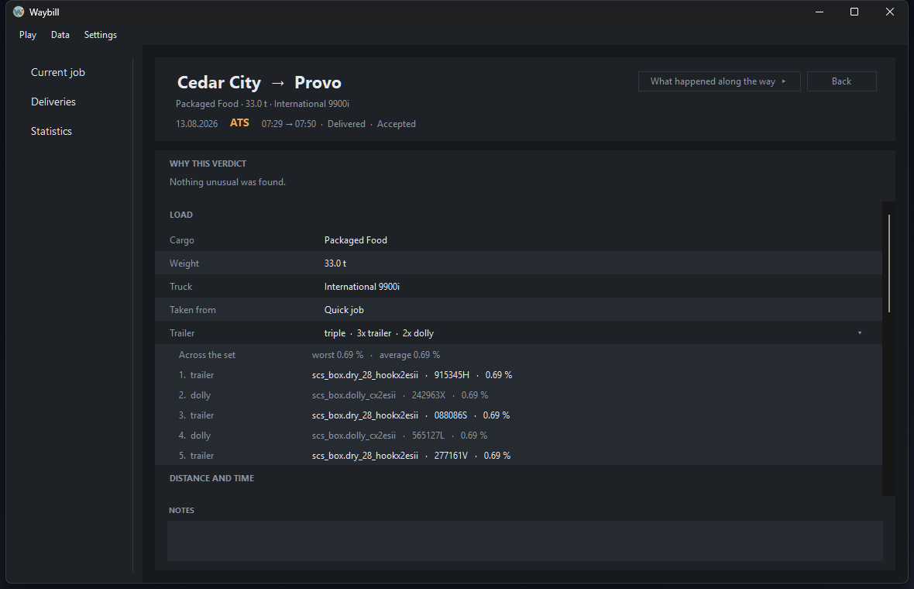

# Waybill

A local delivery tracker for **Euro Truck Simulator 2** and **American Truck
Simulator**. It detects the start and the end of a job on its own, writes it to a
local database and shows statistics. No account, no internet, no second program.

A *waybill* is the document that travels with a shipment and carries the route,
the cargo and the sender. That is exactly what this app keeps about every drive.



## Why it exists

TrucksBook invalidates a delivery if lane assist was switched on during it.
Waybill takes the opposite position:

> **A delivery is never invalidated because the driver used an assist.**

Assists, cruise control, speeding, collisions and fines are stored as metadata
and shown in statistics, never as grounds for refusing a delivery.

## How a delivery is judged

Every finished delivery gets one of three states.

| State | Meaning |
|---|---|
| `accepted` | Nothing unusual was found |
| `review` | Something is worth a look, but nothing suggests the driving was faked |
| `rejected` | Direct evidence that the driving did not happen |

**Rejection is reserved for a delivery being claimed without the driving behind
it.** There are three such cases, and no others:

* a teleport, meaning a jump across the map that no vehicle could have driven
* an odometer that moved further in one instant than driving can account for
* a distance of essentially zero

Everything else is a flag. A flag is visible on the row and says what it is,
and that is all it does: the delivery keeps its distance, its payout and its
place in the statistics, which count every row whatever its state. Reaching
review costs nothing.

A verdict is never left unexplained. Hovering it in the list names what was
found, and the delivery's own card opens with *Why this verdict*: each flag in
words, with the figures behind it where two measurements disagreed, and a line
saying plainly that none of it refuses the delivery.

What lands in review is, for instance, a job that stopped existing without
ending, one abandoned past its window, a top speed no truck reaches, or the two
independent distance measurements disagreeing with each other or with the figure
the game reports on arrival.

The distinction that matters: **not finishing a delivery is not cheating**.
Switching to another profile, quitting the game and never coming back, a crash
mid drive: none of that claims a delivery, so none of it is refused. It is
recorded for what it is, an unfinished drive, with the kilometres actually
driven kept.

The other half of the same idea is that ordinary play is recognised rather than
punished. Pausing into a menu or photo mode, sleeping in the cab, taking a ferry,
loading an earlier save, being teleported into a company truck by a quick job,
restarting the tracker mid delivery: each of these looks alarming in raw
telemetry, and each is identified for what it is instead of counting against the
driver.

Every state, flag and anomaly is listed with its meaning in
[`docs/reference.md`](docs/reference.md).

## Features

* Detects the start and the end of a job with no manual input
* Measures distance, fuel, speed, damage, fines, tolls and ferries
* Records an event timeline, so the exact moment of a fine or a collision is kept
* Keeps every unit of a double or a triple, each with the damage it took
* Says which market a job came from, and whether the trailer was your own
* Explains every verdict in words rather than leaving a label on the row
* Stores route coordinates for a map view later on
* Resumes an interrupted job after a crash or after quitting mid drive
* Launches the game from the window, including a telemetry plugin check
* Shows the current delivery on Discord, over the local pipe, with no account
* Imports history from TrucksBook
* Stores in SQLite, exports to CSV and JSON, backs up and restores
* Interface in English and Slovak

## Requirements

* Windows
* [.NET 9 SDK](https://dotnet.microsoft.com/download) to build from source
* The RenCloud telemetry plugin, bundled in [`third-party/`](third-party/README.md)

## Installation

Build from source:

```bash
dotnet build src/Waybill
```

The app then starts from `Waybill.exe` in
`src/Waybill/bin/Debug/net9.0-windows/`.

The first step after launching is *Play → Install telemetry plugin*, which asks
for `Win64/scs-telemetry.dll` from `third-party/`. Without the plugin the game
publishes no telemetry and Waybill has nothing to track.

### Standalone .exe

Run from the repository root, since the paths in the command are relative:

```bash
dotnet publish src/Waybill -c Release -r win-x64 -p:PublishSingleFile=true -o dist
```

The result is a single `dist\Waybill.exe` of about 50 MB that runs on a machine
without .NET installed. It can be moved anywhere: the database and the recordings
live in `%LOCALAPPDATA%\Waybill\`, independent of where the exe sits.

## Usage

Start order does not matter, the app connects to the game as soon as it finds it.
Jobs are detected and saved without any input.

Three pages down the left. *Deliveries* is the history, with search, a filter and
the verdict on each drive.

*Current job* is what the engine sees right now: the route, the cargo, how far
along the drive is, and a log of what has happened, each entry with its figure,
so a fine reads `Fine: 700 $ (crash)` rather than just `Fined`.

Double clicking a delivery, or pressing Enter on it, opens its own card. It starts
with why it got the verdict it did, then every figure the tracker kept.



*What happened along the way* slides the timeline out from the right. It is worth
reading when something went wrong and worth nothing when nothing did, so it stays
out of the way until asked for.



*Statistics* is the whole logbook at a glance, on one screen with no scrolling.



## Doubles and triples

The game shows one condition for the whole set however many units are behind the
truck. Telemetry has them separately, and Waybill keeps each one.

The *Trailer* line folds the set away: closed it says what the set is, opened it
lists every unit in the order they are hitched, with its plate and the damage it
took. A dolly is named as a dolly, so counting or averaging does not treat the
converter as cargo capacity, and a trailer you own says so.



The configuration comes from the game itself, which is where `single`, `double`,
`rmdouble` and `triple` come from. It is worth knowing that the game reports its
own idea of it: a three section car transporter calls itself `single`, because it
is one articulated vehicle rather than a road train.

Splitting the set apart is not only bookkeeping. On one triple the leading unit
took fifteen times the body damage of the others while the wheels wore evenly
across all three, which is the difference between clipping something and simply
driving a long way. One figure for the set hides that entirely.

## Discord

*Settings → Discord* puts the current delivery on the Discord profile: the route,
the cargo, how far along the drive is, and a counter of how long it has been
running. Between jobs it says so, and with the game closed it shows nothing at
all.

It talks to the Discord client on the same machine through its local pipe, so
nothing leaves the computer and no account is involved. Discord not running
simply means nothing is shown.

Setting it up takes one value. Create an application at
[discord.com/developers](https://discord.com/developers/applications), whose name
is what appears above the presence, and paste its Application ID into *Settings →
Discord → Application ID*. The ID is public by design and is not a password.
Until it is filled in, nothing is sent anywhere.

Uploading three images to that application under *Rich Presence → Art Assets*,
named `ets2`, `ats` and `waybill`, gets the icons as well. Without them the text
still shows.

## Command line

The window is the usual way to use it, but everything also works from a script:

```bash
Waybill.exe --list [n]                  # recent deliveries
Waybill.exe --stats [days]              # summary, overall or for a period
Waybill.exe --export csv|json [path]    # export the history
Waybill.exe --import-trucksbook <csv>   # import history from TrucksBook
Waybill.exe --backup [path]             # back up the database
Waybill.exe --restore <path>            # restore from a backup
Waybill.exe --rebuild                   # recompute deliveries from recordings
Waybill.exe --replay <recording>        # replay an old recording
Waybill.exe --test-resume <recording> <line>   # test resume after a restart
```

## Where the data lives

Everything sits in `%LOCALAPPDATA%\Waybill\`, outside the project folder, so a
rebuild or a `dotnet clean` cannot take any of it with it.

| What | Where |
|---|---|
| Delivery database | `deliveries.db` |
| Backups | `backups/` |
| Raw telemetry recordings | `sessions/` |
| Job in progress | `in-progress.json` |
| Settings, including the Discord application ID | `settings.json` |

Recordings are packed into `.gz` once a session ends, roughly 13x less space.
They are never deleted: they are the input for `--rebuild` and `--replay`, both
of which read them packed or unpacked.

A delivery's identity is computed from the game, the moment the job was accepted
and the offer itself, so the same drive always derives to the same delivery. That
is what lets a rebuild update the history rather than having to delete it first.

## Units

By default they follow the game. ATS uses imperial (mi, gal, mph, $) and ETS2
metric (km, l, km/h, €). The *Units* menu forces one system for both.

The database always stores metric and converts only for display. The history
therefore does not depend on which setting was active during the drive, and
switching redraws old deliveries too.

## How distance is measured

Distance follows the odometer, the same unit system the game itself and the job
offer report. World position is stored separately, for teleport detection and for
drawing the route later. Details in [`docs/measurement.md`](docs/measurement.md).

## Importing from TrucksBook

*Data → Import history from TrucksBook*, then pick the CSV export. The import is
idempotent and keyed on the TrucksBookID, so the same file can be run repeatedly
without producing duplicates.

The export uses the units of that profile and every value carries its unit with
it (`157 mi`, `5.9 mpg`), so conversion follows what is actually in the file.
Imported deliveries get the `imported` status, because there is no telemetry
behind them to verify.

Deliveries that TrucksBook counted as 0 distance, meaning the ones it refused,
are imported with their planned distance and a note. Waybill counts them.

## Development

The recordings in `sessions/` double as regression tests. After a change in the
tracker:

```bash
Waybill.exe --replay <recording>
```

and compare the numbers. `--test-resume` additionally simulates a restart in the
middle of a drive and compares the result against one continuous run.

`--rebuild` is worth running after every detection fix, because old rows
otherwise keep the verdict issued by the version current at the time.

It only touches the periods the recordings cover. A delivery driven at a time no
surviving recording spans is kept exactly as it is rather than deleted in the
hope something replaces it, and the run reports how many were kept that way.
Imported rows are left alone too, as there is nothing to recompute them from.
Everything is replayed before anything is deleted, so an unreadable recording
cannot leave the history half restored, and a backup is taken first regardless.

## Layout

```
src/Waybill/
├── Tracking/       job state machine, SDK adapter, engine, formatting
├── Storage/        SQLite (deliveries, events, trip_points), TrucksBook import
├── Integrations/   Discord Rich Presence over the local pipe
├── SCSSdkClient/   vendored C# SDK client (MIT, with local fixes)
├── GameLauncher.cs finding and launching the games through Steam
├── MainForm.cs     the window
└── Program.cs      CLI and entry point
assets/             logo and icon source
docs/               vision, roadmap and technical notes
third-party/        telemetry plugin for the game
archive/            retired, no longer used
```

## Status

Working: automatic tracking and saving, launching the game from the app, resume
after a restart, history with search and notes, statistics, event timeline,
per unit damage across a coupled set, Discord Rich Presence, TrucksBook import,
export and backups.

Missing: the map and route replay, although the coordinates are already being
collected, plus achievements and whole session statistics. Details in
[`docs/roadmap.md`](docs/roadmap.md).

## Licence

[MIT](LICENSE). The vendored SDK client and the RenCloud plugin are MIT as well,
so the whole project sits under one licence.

Waybill is not affiliated with TrucksBook, endorsed by it, or a continuation of
it. The name appears here only to refer to the service whose CSV exports the
import reads, and to explain what this project does differently. Euro Truck
Simulator 2 and American Truck Simulator are the property of SCS Software, who
are likewise not involved in this project.
